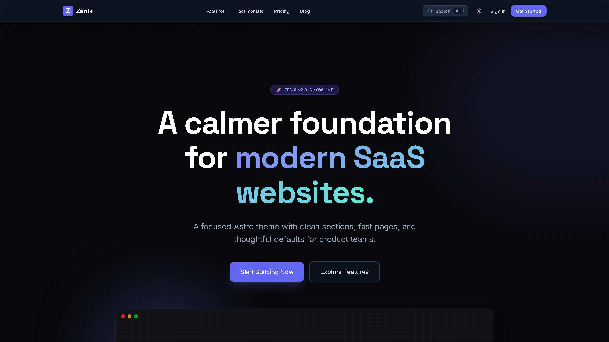
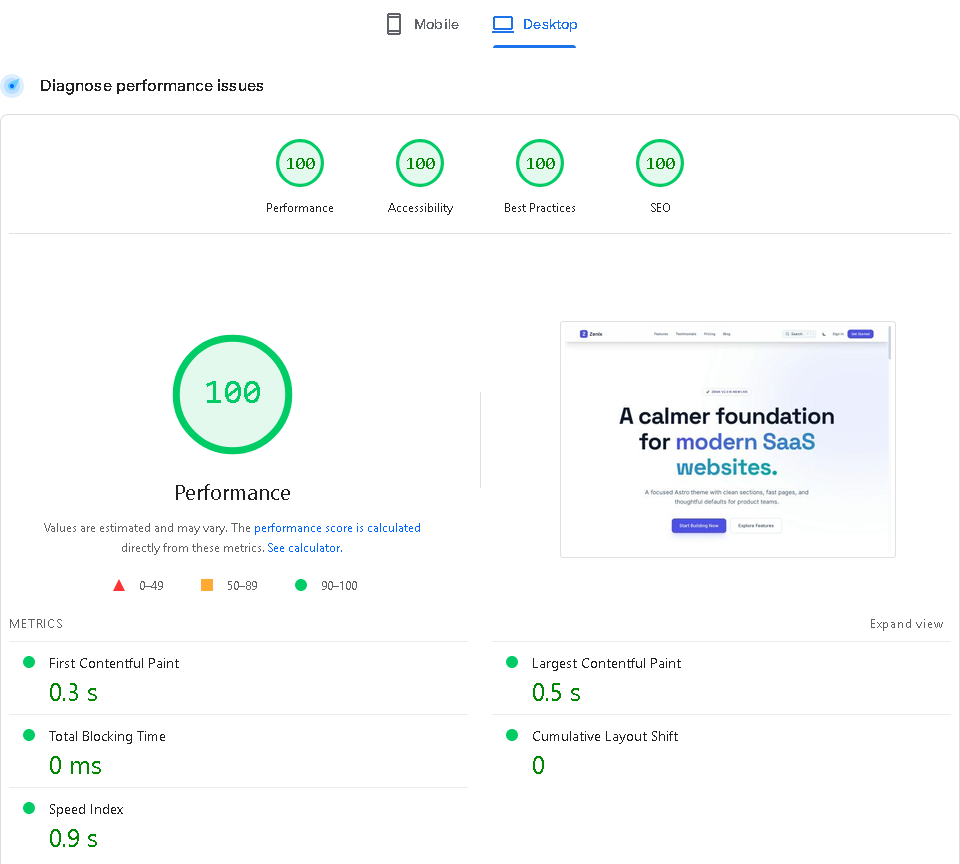
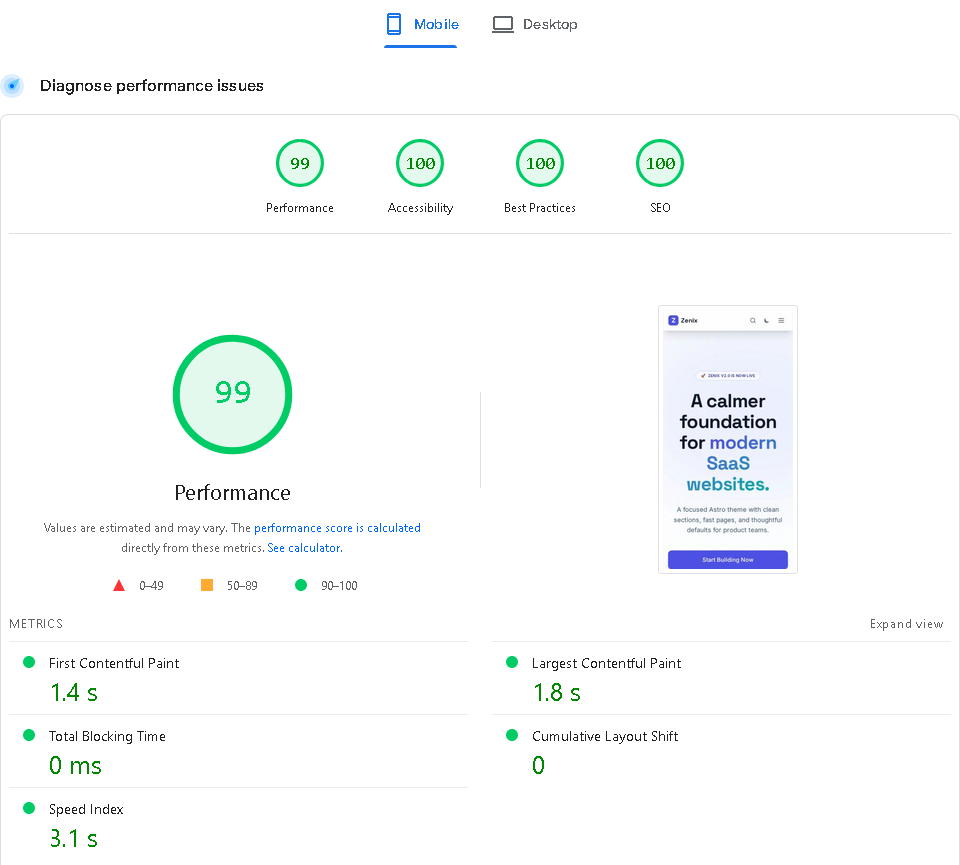

# Zenix

Zenix is a polished Astro SaaS theme by [Farros FR](https://farrosfr.com) with responsive landing sections, pricing, blog, changelog, dark mode, search, and MDX content support.

[Live demo](https://zenix.farros.co/) · [Repository](https://github.com/farrosfr/zenix)





## Features

- Astro 6 with static output
- Tailwind CSS 4 styling
- Responsive SaaS landing page sections
- Pricing, FAQ, testimonials, blog, and changelog pages
- MDX content with reusable callout components
- Dark and light mode with persisted user preference
- Command palette search
- Astro view transitions
- Playwright UI regression tests

## Quick Start

Create a new Astro project from the GitHub template:

```bash
npm create astro@latest -- --template farrosfr/zenix
```

Or clone the repository directly:

```bash
git clone https://github.com/farrosfr/zenix.git my-saas-site
cd my-saas-site
npm install
npm run dev
```

Open `http://localhost:4321/` in your browser.

## Commands

```bash
npm run dev       # Start the local dev server
npm run build     # Build the production site
npm run preview   # Preview the production build
npm run test:e2e  # Run Playwright regression tests
```

## Configuration

Most site-level settings live in `src/config.ts`:

```ts
export const SITE_TITLE = 'Zenix';
export const SITE_DESCRIPTION = 'High-converting, performance-focused Astro theme for Micro-SaaS products.';
export const SITE_URL = 'https://zenix.farros.co';

export const SOCIAL_LINKS = {
  twitter: 'https://twitter.com/farrosfr_',
  github: 'https://github.com/farrosfr',
  linkedin: 'https://linkedin.com/in/yourhandle',
};
```

Update these values before publishing your own site.

## Content

Blog posts and changelog entries are powered by Astro content collections.

- Blog posts: `src/content/blog/`
- Changelog entries: `src/content/changelog/`
- Authors: `src/content/authors/`

Example blog post:

```mdx
---
title: "My First Post"
description: "A short summary."
pubDate: 2026-06-01
author: farros
tags: ["update", "feature"]
---

# Hello World

<Callout type="success" title="Ready">
  MDX components can be used directly inside content.
</Callout>
```

## Deployment

Zenix builds to a static site and can be deployed to Vercel, Netlify, Cloudflare Pages, GitHub Pages, or any static hosting provider.

For production, update `site` in `astro.config.mjs` to match your domain.

### Cloudflare Pages

When importing this GitHub repository into Cloudflare Pages, use:

```text
Framework preset: Astro
Build command: npm run build
Build output directory: dist
Root directory: /
Node.js version: 22.12.0 or newer
```

The repository includes `wrangler.toml` with `pages_build_output_dir = "dist"` for Cloudflare Pages compatibility.

## Theme Submission Notes

This repository is public, uses public npm dependencies, and includes setup documentation for new users. Preview images for the Astro theme directory should be 16:9, at least 1280px wide, and less than 5MB combined.

## License

MIT
